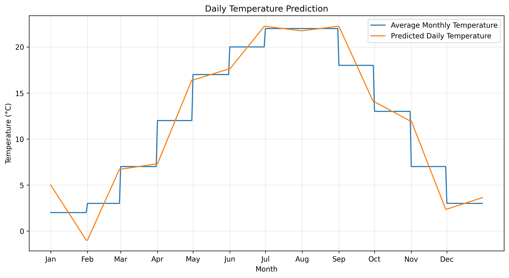

# 每日溫度預測工具

這個專案提供了一個簡單的線性預測模型，用於預測全年每日溫度變化。基於每月平均溫度數據，生成更細緻的每日溫度預測。

## 預測結果展示



- 藍線：每月平均溫度
- 橘線：預測的每日溫度變化

## 功能特點

- 基於月平均溫度進行每日溫度預測
- 考慮月初到月中、月中到月底的溫度變化趨勢
- 自動處理月份之間的溫度過渡
- 生成視覺化圖表展示預測結果

## 使用說明

1. 確保已安裝必要的 Python 套件：
```bash
pip install matplotlib
```

2. 運行程式：
```bash
python weather_temperature_linear_predict.py
```

## 預測方法說明

- 使用線性預測模型
- 每個月的溫度變化分為兩個階段：
  - 月初到月中：線性增長到該月平均溫度
  - 月中到月底：保持相同斜率繼續變化
- 確保月份之間的溫度平滑過渡

## 資料說明

- `day_of_month`：每月天數
- `day_of_month_leap_year`：閏年每月天數
- `average_of_month_temperature`：每月平均溫度
- `initial_temperature`：年初起始溫度

## 輸出結果說明

預測結果圖表包含：
- X軸：月份（January到December）
- Y軸：溫度（攝氏度）
- 兩條曲線對比展示原始月平均溫度和預測的每日溫度變化

## 注意事項

- 當前版本使用固定的起始溫度
- 預測結果為簡化模型，僅供參考
- 可根據實際需求調整參數
